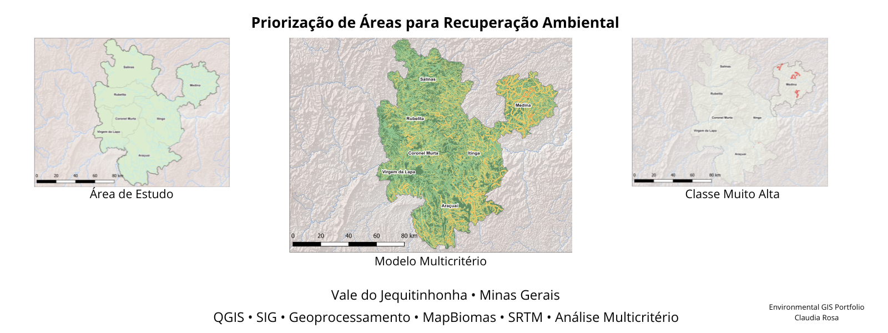
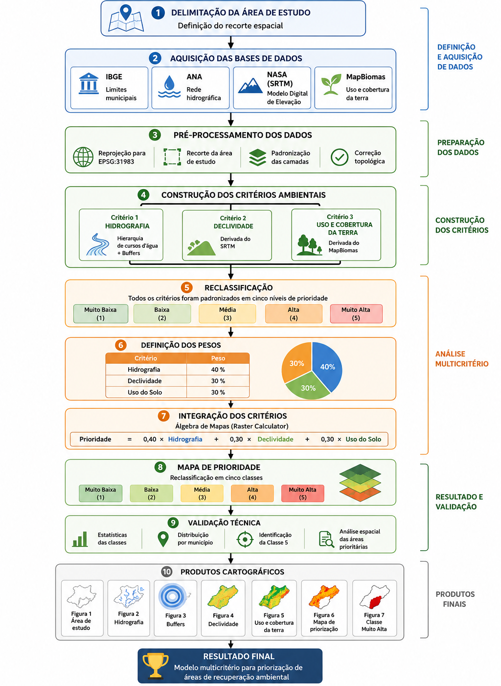
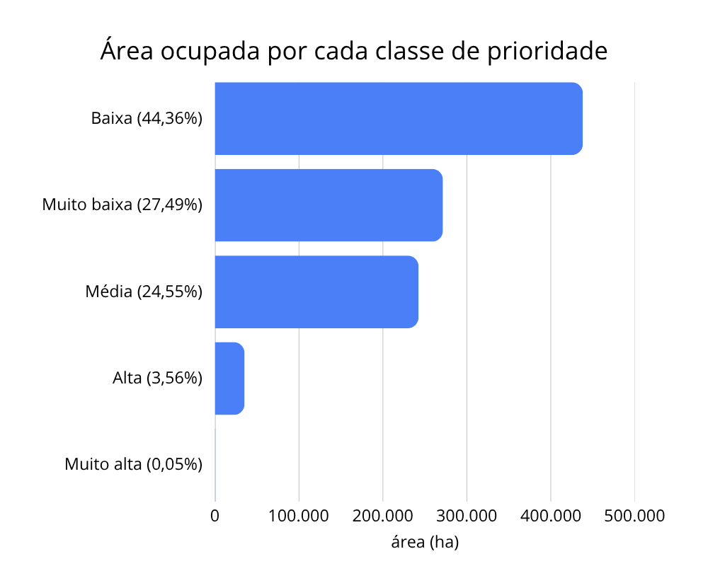

# Priorização de Áreas para Recuperação Ambiental no Vale do Jequitinhonha (MG)

## Visão Geral

Este projeto apresenta uma metodologia de **Análise Multicritério em Sistema de Informação Geográfica (SIG)** para identificação de áreas prioritárias para recuperação ambiental no Vale do Jequitinhonha, Minas Gerais.

A metodologia integra informações de:

- Rede hidrográfica
- Declividade do terreno
- Uso e cobertura da terra

A integração desses critérios foi realizada por meio de Álgebra de Mapas no **QGIS**, resultando em um mapa de priorização ambiental classificado em cinco níveis de prioridade.

## Objetivo

Desenvolver um modelo espacial capaz de identificar áreas prioritárias para recuperação ambiental, fornecendo suporte técnico para:

- Planejamento ambiental;
- Recuperação de áreas degradadas;
- Gestão de recursos hídricos;
- Apoio ao licenciamento ambiental;
- Programas de restauração ecológica.

# Área de Estudo

O estudo foi desenvolvido no Vale do Jequitinhonha, nordeste do estado de Minas Gerais, abrangendo os municípios de:

- Medina
- Araçuaí
- Coronel Murta
- Salinas
- Rubelita
- Virgem da Lapa
- Itinga

A região vem se destacando nacionalmente pela expansão da mineração de lítio, tornando-se estratégica para estudos de planejamento e recuperação ambiental.

# Metodologia

O fluxo metodológico foi composto pelas seguintes etapas:

1. Delimitação da área de estudo;
2. Aquisição das bases cartográficas;
3. Pré-processamento dos dados;
4. Construção dos critérios ambientais;
5. Reclassificação dos critérios;
6. Análise multicritério;
7. Produção cartográfica;
8. Validação dos resultados.

## Bases de Dados

| Base | Fonte |
|-------|-------|
| Limites Municipais | IBGE |
| Rede Hidrográfica | ANA |
| Modelo Digital de Elevação (SRTM) | NASA |
| Uso e Cobertura da Terra | Projeto MapBiomas |

# Critérios Utilizados

| Critério | Peso |
|----------|------|
| Hidrografia | 40% |
| Declividade | 30% |
| Uso e Cobertura da Terra | 30% |

# Produtos Cartográficos

O projeto gerou nove produtos cartográficos:

- Figura 1 – Localização da área de estudo
- Figura 2 – Fluxograma metodológico
- Figura 3 – Rede hidrográfica hierarquizada
- Figura 4 – Zonas de influência hídrica
- Figura 5 – Declividade reclassificada
- Figura 6 – Uso e cobertura da terra
- Figura 7 – Mapa de prioridade para recuperação ambiental
- Figura 8 – Áreas classificadas como Muito Alta Prioridade (Classe 5)

# Principais Resultados

O modelo classificou toda a área de estudo em cinco níveis de prioridade para recuperação ambiental.

### Distribuição das Classes

| Classe | Área (km²) | Percentual |
|---------|-----------:|-----------:|
| Muito Baixa | 271,472 | 27,49 % |
| Baixa | 438,112 | 44,36 % |
| Média | 242,419 | 24,55 % |
| Alta | 35,145 | 3,56 % |
| Muito Alta | 0,452 | 0,05 % |

Foram identificadas **302 áreas classificadas como Muito Alta Prioridade**, distribuídas em três municípios.

### Distribuição da Classe Muito Alta

| Município | Área (ha) | Participação |
|------------|----------:|-------------:|
| Medina | 445,933 | 98,57 % |
| Araçuaí | 5,658 | 1,25 % |
| Coronel Murta | 0,809 | 0,18 % |

Os resultados demonstram que a priorização ambiental depende da combinação entre hidrografia, relevo e uso da terra, e não exclusivamente da presença de atividades minerárias.

# Estrutura do Repositório

vale-jequitinhonha-priorizacao-recuperacao-ambiental/                  
│
├── README.md                
├── LICENSE                 
│
├── docs/                
│   └── Relatorio_Tecnico.pdf            
│
├── imagens/                 
│   ├── Banner.png            
│   ├── area_estudo.png               
│   ├── fluxograma.png            
│   ├── resultado_principal.png           
│   ├── alta_prioridade.png                  
│   ├── grafico_barras.png                
               

# Tecnologias Utilizadas

- QGIS
- SIG
- Geoprocessamento
- Álgebra de Mapas
- Raster Calculator
- MapBiomas
- SRTM
- ANA
- IBGE

# Possíveis Aplicações

- Planejamento Ambiental
- Recuperação de Áreas Degradadas
- Recuperação de APPs
- Planejamento Territorial
- Licenciamento Ambiental
- Mineração Sustentável
- Gestão de Recursos Hídricos

# Trabalhos Futuros

Como continuidade deste projeto, pretende-se:

- Automatizar todo o fluxo utilizando **Python + PyQGIS**;
- Integrar dados do **Google Earth Engine**;
- Incorporar novos critérios ambientais;
- Aplicar o modelo em outras regiões do Brasil;
- Desenvolver um sistema automatizado de priorização ambiental.

# Relatório Técnico

O relatório completo encontra-se disponível na pasta:

**[Baixar Relatório Técnico (PDF)](doc/Relatorio_Tecnico.pdf)**

# Licença

Este projeto é disponibilizado para fins acadêmicos e de pesquisa.

# Autora

**Claudia Rosa**

Mestre em Química Ambiental

Especialista em Geoprocessamento e Ciência de Dados (em formação)

GitHub:
https://github.com/claudiarpaim

LinkedIn:
https://linkedin.com/in/claudia-rosa-datascience

